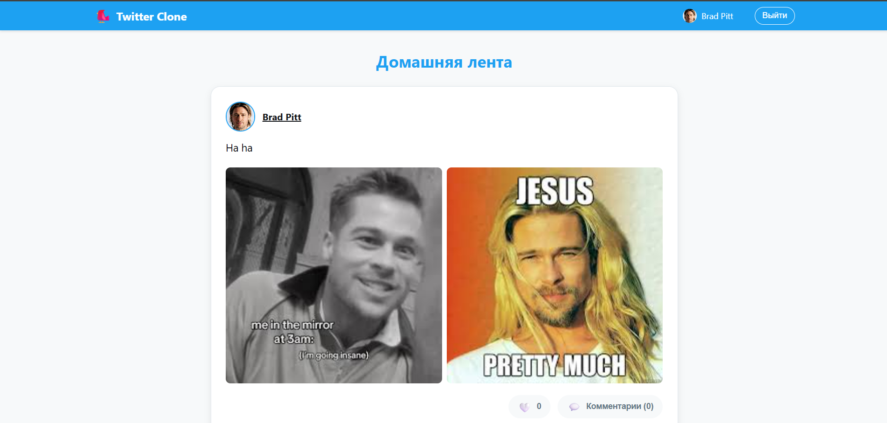
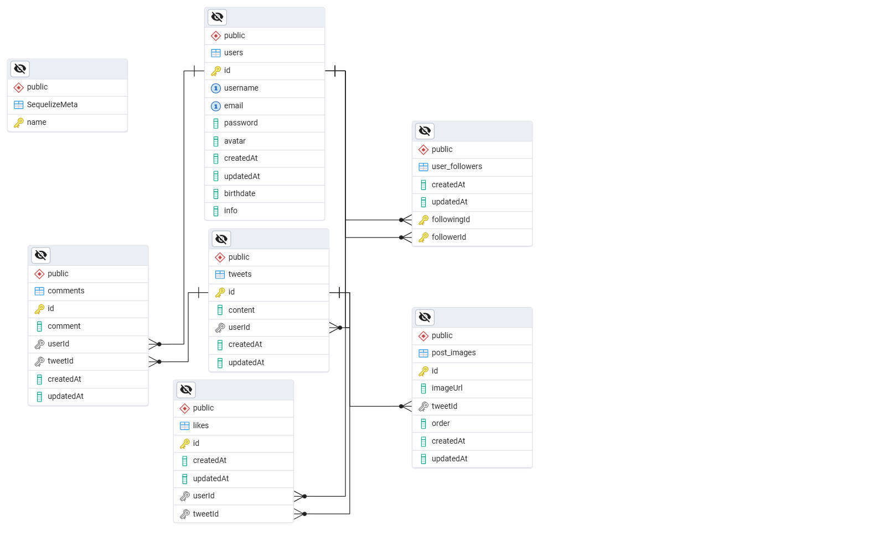

# Twitter Clone

Современное веб-приложение - клон Twitter на стеке Node.js + React.




---

### База данных

Спроектирована с помощью Sequelize, развернута на PostgreSQL (PgAdmin 4).



---

### 🚀 Быстрый старт

**Требования:** Node.js (версия 16+)

```bash
# Клонирование и установка зависимостей
git clone https://github.com/Artem-Afanasev/twitter_clone.git
cd twitter-clone
npm i

# Запуск сервера (бэкенд)
npm run dev

# В новом терминале - запуск клиента (фронтенд)
cd client
npm start
